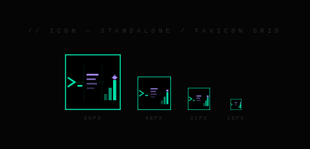
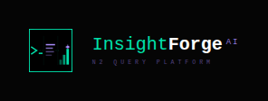
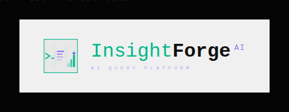

<div align="center">
  
</div>

<p align="center">
  
  
  
</p>

<p align="center">
  <a href="#02--brand-logic"></a>
  <a href="#03--architecture"></a>
  <a href="#04--protocol-initiation"></a>
</p>

---

# 01 // CORE IDENTITY

> **The Enterprise SQL Intelligence Layer**
> `InsightForge AI (QueryPilot)` empowers analysts with governed, deterministic AI-driven data insights while maintaining absolute security on Azure infrastructure. 

<br/>

---

# 02 // BRAND LOGIC

<table width="100%">
  <tr>
    <td width="33%" align="center">
      
      <br/><br/>
      <b style="color: #00F5B8;">[01] OPTICAL_PRECISION</b><br/>
      <code>ZERO-CODE ANALYTICS</code><br/>
      <p align="left" style="color: #64748B;">Strict mapping of natural language to deterministic SQL routines, bypassing the data engineering bottleneck with absolute precision.</p>
    </td>
    <td width="33%" align="center">
      
      <br/><br/>
      <b style="color: #9D72FF;">[02] CHROMATIC_ENERGY</b><br/>
      <code>HUMAN-IN-THE-LOOP</code><br/>
      <p align="left" style="color: #64748B;">"The light of insight in the dark." Our orchestrator pauses execution for manual human approval on sensitive operations or protected entities.</p>
    </td>
    <td width="33%" align="center">
      
      <br/><br/>
      <b style="color: #00F5B8;">[03] MONO_HERITAGE</b><br/>
      <code>EXECUTIVE EXPLANATION</code><br/>
      <p align="left" style="color: #64748B;">Honest, technical readability translating raw tabular query data into clear, fraud-oriented executive intelligence payloads.</p>
    </td>
  </tr>
</table>

<br/>

---

# 03 // ARCHITECTURE

```text
// SYSTEM TOPOLOGY v2.1.0_PROD
+-----------------+---------------------------------------------+
| LAYER           | COMPOSITE                                   |
+-----------------+---------------------------------------------+
| Presentation    | Next.js / TypeScript / React (Deep Void UI) |
| Core Backend    | Azure Functions Isolated Worker (.NET 8)    |
| Intelligence    | Azure OpenAI API (GPT-4o-mini Neural Core)  |
| Infosec         | Azure AI Content Safety / Azure Key Vault   |
| Orchestrator    | Azure Durable Functions (Stateful)          |
| Persistence     | Azure SQL Database                          |
+-----------------+---------------------------------------------+
```

<br/>

---

# 04 // PROTOCOL INITIATION

<details>
<summary><code>[+] DECRYPT_EXECUTION_COMMANDS (Technical Setup)</code></summary>

<br/>

**1. INITIALIZE API CORE (port 7071)**
```powershell
cd C:\Users\Jessy\Documents\GitHub\QueryPilotAI\backend\src\Functions.Api
func start
```

**2. INITIALIZE PRESENTATION LAYER (port 3000)**
```powershell
cd C:\Users\Jessy\Documents\GitHub\QueryPilotAI\frontend
npm run dev
```

**3. VERIFY SECURE MAINFRAME CONNECTION**
```powershell
Invoke-RestMethod -Method Post -Uri "http://localhost:3000/api/test-connection" -Body (@{ type="Azure SQL"; host="tcp:<YOUR_DB_HOST>"; database="<YOUR_DB>"; username="<USER>"; password="<PWD>" } | ConvertTo-Json) -ContentType "application/json"
```

</details>

<br/><br/>

<div align="center">
  
  <br/>
  <code style="color: #64748B;">© 2026 INSIGHTFORGE AI PROTOCOL // SECURED_IDENTITY_SYSTEM // NON_DISCLOSURE_REQUIRED</code>
</div>
