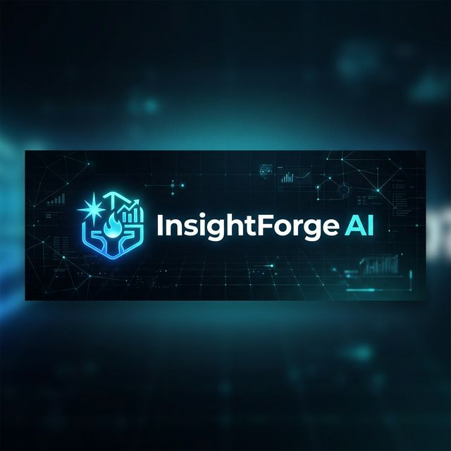

<div align="center">



# **InsightForge AI**
**AI Analytics Engineering Platform**

English | [Español](#) | [Documentation](./docs)

[Architecture](#-architecture) • [Key Features](#-key-features) • [Getting Started](#-getting-started) • [Operational Guide](#-operational-guide)

[](https://innovation.microsoft.com/) [](https://partner.microsoft.com/)
<br/>
[](#) [](#)

<br/>

[](https://nextjs.org/) [](https://dotnet.microsoft.com/) [](https://learn.microsoft.com/en-us/entra/identity-platform/msal-overview) [](#)

<br/>

⭐ **Like what we're doing? Give us a star ⬆️**

</div>

---

InsightForge AI is an end-to-end analytical engineering agent built specifically for the enterprise. It solves a massive bottleneck in data-driven organizations: **generating SQL safely, efficiently, and correctly.**

* **The Business Interface** – Users ask natural language questions, the agent translates them to validated SQL, executes them securely, and delivers insights via automated summaries.
* **The Engineering Backend** – Decomposes analytical intent, guards against abuse with AI Content Safety, and manages rigorous human-in-the-loop approval workflows using Azure Durable Functions.

Ship analytics at the speed of thought, with production-ready observability and enterprise-grade security.

<br/>

## ✨ Key Features

<table width="100%">
  <tr>
    <td width="50%" valign="top">
      <h3>🧠 NLP to Validated SQL</h3>
      <p>Seamlessly translates complex human intent into optimized queries via <b>Azure OpenAI</b>. The semantic engine ensures syntax correctness before execution against your warehouse.</p>
    </td>
    <td width="50%" valign="top">
      <h3>🛡️ Enterprise-Grade Safety</h3>
      <p>Strictly guards against prompt injection and abusive queries using <b>Azure AI Content Safety</b>, keeping your Azure SQL Database hardened and compliant at all times.</p>
    </td>
  </tr>
  <tr>
    <td width="50%" valign="top">
      <h3>✅ Human-in-the-Loop</h3>
      <p>Not everything should auto-execute. Built-in orchestration workflows via <b>Azure Durable Functions</b> ensure that sensitive or high-impact queries require human approval.</p>
    </td>
    <td width="50%" valign="top">
      <h3>📊 Business Explanations</h3>
      <p>Results aren't just rows and columns. InsightForge automatically converts result datasets into <b>executive insights</b>, visualizing them beautifully with React Markdown and Recharts.</p>
    </td>
  </tr>
</table>

---

## 🏗️ Architecture & Stack

InsightForge AI runs on a fully serverless, highly scalable Microsoft Azure infrastructure, orchestrated securely to deliver instant analytics without sacrificing control.

<div align="center">
  
  
  
</div>
<br/>

* 🖥️ **Frontend:** Next.js 15 App Router | React 18 | Tailwind CSS 3.4
  * Deeply integrated `MSAL React` for strict M365/Entra ID authentication.
  * Modern UX powered by `Recharts` and `Sonner`.
* ⚙️ **Backend:** Azure Functions Isolated Worker (.NET 8)
  * Heavy lifting via `Microsoft.Azure.Functions.Worker.Extensions.DurableTask`.
  * Clean Architecture: `Core.Domain`, `Infrastructure.Sql`, `Infrastructure.AzureOpenAI`.
* ☁️ **Cloud Infrastructure:**
  * Azure SQL Database (v12.0)
  * Azure OpenAI (S0)
  * Log Analytics Workspace & App Insights
  * Key Vault & Content Safety

---

## 🚀 Getting Started

Deploying InsightForge AI is incredibly fast. With our fully defined IaC, you can have the entire system running in Azure in minutes.

### 1. Provision Infrastructure
We provide `main.bicep` for 1-click Azure deployments:
```bash
cd infra/bicep
../deploy.sh   # Linux / macOS
# or
..\deploy.ps1  # Windows
```

### 2. Configure Environment Secrets
Refer to `docs/CLAVES_Y_CREDENCIALES.md` to get your team's hackathon keys. Do NOT upload real keys to the repository.

<details>
<summary><b>Backend <code>local.settings.json</code></b></summary>
<br>

Place this entirely within `backend/src/Functions.Api/local.settings.json`:
```json
{
  "IsEncrypted": false,
  "Values": {
    "AzureWebJobsStorage": "<STORAGE_CONN_STRING>",
    "FUNCTIONS_WORKER_RUNTIME": "dotnet-isolated",
    "SqlConnectionString": "Server=tcp:<YOUR_SERVER>.database.windows.net,1433;Initial Catalog=<DB>;Encrypt=True;TrustServerCertificate=True;Authentication=Active Directory Default;",
    "AzureOpenAI__Endpoint": "https://<YOUR_OPENAI>.openai.azure.com/openai/v1",
    "AzureOpenAI__Deployment": "gpt-4o-mini",
    "ContentSafety__Endpoint": "https://<YOUR_CONTENT_SAFETY>.api.cognitive.microsoft.com/"
  }
}
```
</details>

<details>
<summary><b>Frontend <code>.env.local</code></b></summary>
<br>

Place this entirely within `frontend/.env.local`:
```env
NEXT_PUBLIC_AZURE_AD_CLIENT_ID=<YOUR_CLIENT_ID>
NEXT_PUBLIC_AZURE_AD_TENANT_ID=common
NEXT_PUBLIC_AZURE_AD_AUTHORITY=https://login.microsoftonline.com/common
NEXT_PUBLIC_REDIRECT_URI=http://localhost:3000/
```
</details>

### 3. Run Locally

Open **Terminal 1** for the .NET Backend Orchestrator:
```powershell
cd backend/src/Functions.Api
func start
```

Open **Terminal 2** for the Next.js Frontend:
```powershell
cd frontend
npm run dev --turbo
```

---

## 🛠️ Operational Guide

Managing state, orchestrations, and database interactions can be done entirely via PowerShell. 
> *Expand to view backend developer commands.*

<details>
<summary><b>Test Database Connection</b></summary>

Verify that your backend can correctly reach Azure SQL:
```powershell
$body = @{
    type     = "Azure SQL"
    host     = "tcp:<YOUR_SERVER>.database.windows.net"
    database = "<YOUR_DB>"
    username = "<USER>"
    password = "<PASSWORD>"
} | ConvertTo-Json

Invoke-RestMethod -Method Post -Uri "http://localhost:7071/api/test-connection" -Body $body -ContentType "application/json"
```
</details>


<details>
<summary><b>Submit a NLP Query</b></summary>

Test the full orchestration pipeline.
```powershell
$query = @{
    question      = "Show me the top 10 most recent transactions"
    userId        = "user@agent.com"
    role          = "FraudAnalyst"
    correlationId = "test-$(Get-Date -Format 'yyyyMMddHHmmss')"
    sessionId     = "console-test"
    connection    = @{
        type     = "Azure SQL"
        host     = "tcp:<SERVER>.database.windows.net"
        database = "<DB>"
        username = "<USER>"
        password = "<PASSWORD>"
    }
} | ConvertTo-Json -Depth 3

Invoke-RestMethod -Method Post -Uri "http://localhost:7071/api/query" -Body $query -ContentType "application/json"
```
</details>

<details>
<summary><b>Approve/Reject Queries (Durable Functions)</b></summary>

Check orchestration status:
```powershell
Invoke-RestMethod -Uri "http://localhost:7071/api/orchestrations/<INSTANCE_ID>"
```

Approve pending queries:
```powershell
$approval = @{ decision = "Approved"; approverUserId = "admin@agent.com"; comments = "Looks good" } | ConvertTo-Json
Invoke-RestMethod -Method Post -Uri "http://localhost:7071/api/orchestrations/<INSTANCE_ID>/approve" -Body $approval -ContentType "application/json"
```
</details>

---

<div align="center">
  <b>Built for the Microsoft Innovation Challenger</b><br>
  <i>Empowering data-driven decisions with safe, transparent AI.</i>
  <br><br>
  
</div>
