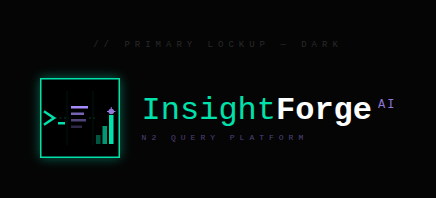
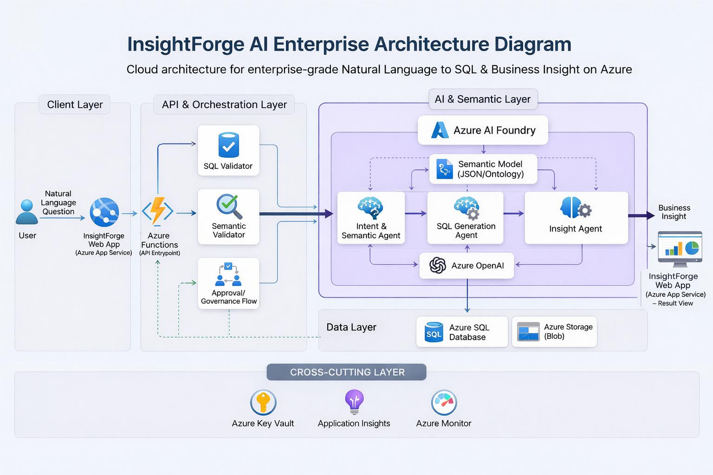

<div align="center">
  

  <h1>InsightForge AI</h1>
  <h3>The Enterprise SQL Intelligence Layer</h3>

  <p>
    <b>English</b> | <a href="README_es.md">Español</a>
  </p>

  <p>
    <a href="docs/InsightForge_AI_Governed_Fraud_Analytics%20final.pdf">
      
    </a>
  </p>

  <p>
    <a href="#-the-solution"><b>Platform Overview</b></a> |
    <a href="#-key-features"><b>Key Features</b></a> |
    <a href="#-architecture--tech-stack"><b>Architecture</b></a> |
    <a href="#-quick-start-judges-corner"><b>Quick Start</b></a>
  </p>

  <p>
    
    
    
    
    
  </p>

  <p>
    ⭐ <b>Like what we're doing? Give us a star!</b> ⬆️
  </p>
</div>

---

**InsightForge AI (QueryPilot)** empowers analysts with governed, deterministic AI-driven data insights while maintaining absolute security on Azure infrastructure. 

## 🚨 The Problem

In the fast-paced world of **fraud detection** and financial analytics, time is of the essence. Yet, highly skilled domain experts (like Fraud Analysts) often face severe bottlenecks:
- **The SQL Barrier:** Analysts depend on data engineers to write complex queries, delaying critical insights.
- **The "Rogue AI" Risk:** Standard LLMs hallucinate table names or, worse, expose highly sensitive Personally Identifiable Information (PII) without governance.
- **Lack of Traceability:** Traditional chat-to-database tools lack the enterprise audit trails and human oversight required in regulated industries.

## 💡 The Solution

InsightForge AI bridges the gap between natural language and complex relational databases. It is not just another "text-to-SQL" wrapper; it is an **enterprise-grade, Human-in-the-Loop orchestration engine**. 

By enforcing strict governance, safe AI execution, and transparent auditability, InsightForge AI allows non-technical domain experts to interrogate massive datasets securely, receiving both accurate data and executive-ready explanations.

## ✨ Key Features & Value Proposition

- 🗣️ **Conversational Analytics (Zero Code):** Analysts ask business questions in natural English or Spanish. QueryPilot maps the intent and generates highly optimized SQL instantly.
- 🛡️ **Ironclad Governance & Human-in-the-Loop:** When a query touches sensitive constraints (e.g., VIP accounts or confidential risk scores), the system *pauses execution*. The query is quarantined until a designated human capability approves or rejects the action.
- 🔒 **Responsible AI Security:** Integrated seamlessly with **Azure AI Content Safety**, instantly blocking prompt injections, abusive language, or unauthorized data exfiltration attempts.
- 📊 **Executive Translation:** We don't just return rows and columns. Our secondary AI agents interpret the tabular results and draft an executive summary explaining the findings in the context of fraud risk.
- 👁️ **Total Observability:** Every intent, generated query, execution time, and AI decision is logged securely for compliance parsing.

## 📸 Platform Experience

### 1. Data Source Hub


> **Insight:** The central command interface where analysts manage their active database connections. The unified workspace allows users to easily toggle between different data environments (e.g., specific Azure SQL nodes or Postgres servers) to interrogate data without ever writing a connection string.

### 2. Seamless Secure Integrations


> **Insight:** Adding a new enterprise database is frictionless. Through the *"Add New Integration"* flow, users securely input host, database, and credential details. In the background, QueryPilot orchestrates the connection validation via the .NET API and securely proxies the credentials to Azure Key Vault, maintaining absolute Zero-Trust compliance.

<br />

## ⚙️ Architecture & Tech Stack (Powered by Azure)

<div align="center">
  
</div>

> **Diagram Flow:** The architecture illustrates the end-to-end integration of our Tech-Brutalist Next.js UI, the Azure API Gateway, the Durable Functions State Orchestrator handling approvals, and the multi-agent AI framework (Query Planner, Data Executor, Executive Explainer).

We built InsightForge AI to be robust, scalable, and inherently secure from day one.

- **Intelligence:** Azure OpenAI (GPT-4o-mini) distributed through intelligent agents.
- **Safety:** Azure AI Content Safety.
- **Orchestration:** Azure Durable Functions (Stateful Serverless) + .NET 8.
- **Experience Layer:** Next.js / React with a premium *Tech-Brutalist / Deep Void* aesthetic.
- **Data Hub:** Azure SQL Database (Protected via Managed Identities).

---

## 🚀 Quick Start (Judge's Corner) <a id="quick-start"></a>

<details>
<summary><b>🛠️ Click to expand instructions for local execution</b></summary>
<br />

*Note: For the hacking period, actual backend configuration variables are located in `docs/CLAVES_Y_CREDENCIALES.md`.*

### Running the Project Locally

**1. Start the Orchestration API (Backend)**
```powershell
cd C:\Users\Jessy\Documents\GitHub\QueryPilotAI\backend\src\Functions.Api
func start
```

**2. Start the Client UI (Frontend)**
```powershell
cd C:\Users\Jessy\Documents\GitHub\QueryPilotAI\frontend
npm run dev
```

**3. Sanity Check SQL Connection**
```powershell
# In a new terminal, verify the functions are talking to Azure SQL securely:
Invoke-RestMethod -Method Post -Uri "http://localhost:3000/api/test-connection" -Body (@{ type="Azure SQL"; host="tcp:<YOUR_DB_HOST>"; database="<YOUR_DB>"; username="<USER>"; password="<PWD>" } | ConvertTo-Json) -ContentType "application/json"
```

</details>

<br />

<div align="center">
  <b>Built with ❤️ by Team Darovero for the Hackathon</b>
  <br/><br/>
  <a href="https://github.com/darovero/QueryPilotAI">Return to top</a>
</div>
